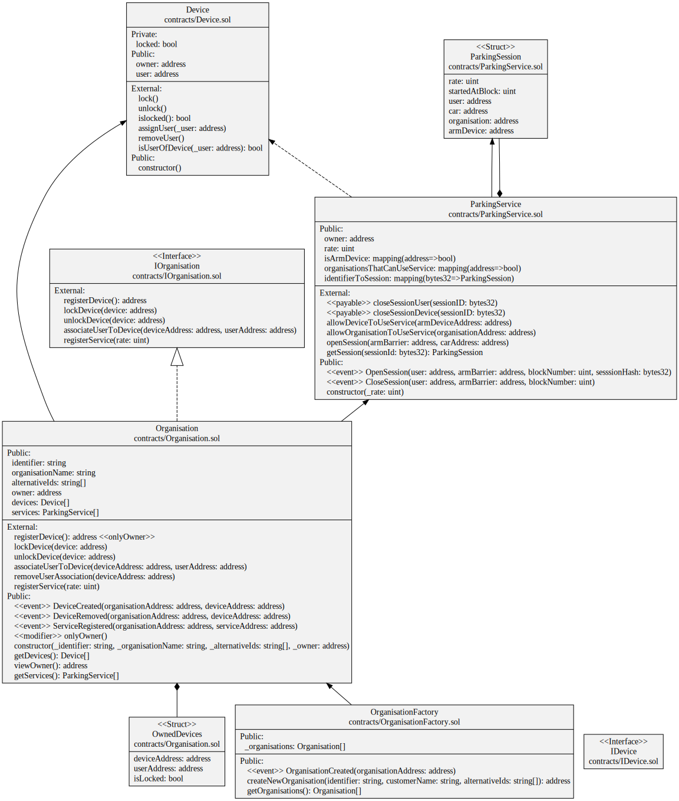

# Parking DApp Corda to EVM Communication (and Vice-Versa)

## Introduction

This document describes the current state of the Parking DApp, with special focus on the next steps to properly integrate it in terms of EVM from/to Corda APIs/node.

## Problem Description


The increasing number of DApps built on multiple blockchains highlights the importance of interoperability between them. To implement the frontend for the Parking DApp, it is necessary to invoke a Corda Sandbox/node that can call already deployed Solidity Smart Contracts on the Vodafone/NodeReal EVM chain (https://vodafone-testnet-explorer.nodereal.io/). Additionally, the Corda node must be able to listen for events emitted by the EVM chain and respond to them appropriately. This presents a challenge for ensuring seamless interaction between the two blockchains and requires effective solutions for achieving cross-chain interoperability.

This document tries to explain the missing pieces to achieve Corda to EVM and vice-versa communication on the Parking DApp.

### Missing Pre-Requisites 

1. Details on how to connect to an existing or new Corda node. The idea is that the frontend of the DApp will use this info to start the parking flow from Corda
2. A Corda node with basic information stored in it. Example: the corda node could have information about devices and organisations that will be sent to already deployed EVM Smart Contracts
3. APIs ou equivalent that allow the following:
   1. Given a specific Ethereum Contract Address, call it with parameters from within the corda node
   2. Process the transaction receipts after calling functions of the EVM smart contracts to get details about possible events emitted
   3. Assuming the DApp calls these directly, return some kind of response so that the frontend of the DApp can handle it successfully

### Basic Example of Required Corda-to-EVM Communication (and Vice-Versa)

The most basic example of Corda-to-Evm and vice-versa communication would be calling from Corda a simple "Hello World" solidity smart contract deployed at address: "0x117a551DBBACa310A5EFC752CEb520b23bfB2147" (https://vodafone-testnet-explorer.nodereal.io/address/0x117a551DBBACa310A5EFC752CEb520b23bfB2147) and then be listening for the only event it emits: **HelloWorld**.

A more in-depth explanation of the above can be seen in the following sequence diagram:


The Parking DApp user clicks on the "Hello World" button which will call a Corda API that it also needs to connect to a Corda node. After this, the Corda API will call the "Hello World" function from the EVM "Hello World" smart contract deployed at address **0x117a551DBBACa310A5EFC752CEb520b23bfB2147**. This smart contract will return a transaction receipt with the "HelloWorld" event in it.
Finally, this transaction receipt is returned back to the Corda API which in turn will extract the "HelloWorld" message from the transaction receipt logs and return this message to the user, which will display it successfully.

## Current Parking DApp Implementation

Currently, the Parking DApp is implemented using ReactJS for the Frontend and Solidity for the EVM Smart Contracts. The next step is to connect to a Corda node and, by using Corda APIs, call the several Solidity Smart Contracts described below.
Please note that this implementation is not final and several changes will need to be made both on the frontend and on the Solidity Smart Contracts. 

In the following subsections, a more detailed explanation of each Smart Contract can be found.

### Smart Contracts Diagram

The following image reflects the current implementation of the parking Solidity Smart Contracts:



1. **Organisation**: responsible for maintaining data regarding organisations
2. **OrganisationFactory**: responsible for only creating new organisations. Available at: 0x17dEdD4228428239E33cd67eC33Ee0fE6DE17a5b (https://vodafone-testnet-explorer.nodereal.io/address/0x17dEdD4228428239E33cd67eC33Ee0fE6DE17a5b)
3. **Device**: handles the logic necessary to add new devices and more
4. **ParkingService**: handles all the logic for the parking scenario, including the opening and closing of the parking gates

#### EVM to Corda and Vice-Versa Communication

Following the exact same logic as the "HelloWorld" sequence diagram mentioned above, a Corda node should be setup so that multiple Corda APIs can connect to it and then call EVM Smart Contracts already deployed on the NodeReal EVM chain.

Note: for now, it is assumed there are three EVM accounts:
1. The 'Mercedes' account, which is responsible for adding new devices (cars) to the Mercedes brand so that they can be used on the parking service
2. The 'Parking' account, which represents the Parking organisation and is responsible for assigning new devices (cars) to the parking service
3. The 'User' account, which is used by the parking service to start a parking session

The Corda APIs need to call the following functions deployed on the EVM Smart Contracts mentioned above:

##### Organisation Smart Contract

1. **createNewOrganisation(identifier, customerName, [alternativeIds])**: 
   * identifier: the organisation identifier
   * customerName: the customer name of that organisation
   * alternativeIds: the alternative Ids that organisation is known for. Example: 
   ```
   createNewOrganization('mercedes', 'mercedes', ['Corda-ID'])
   ```
2. **createNewOrganisation(identifier, customerName, [alternativeIds])**:
   * identifier: the organisation identifier
   * customerName: the customer name of that organisation
   * alternativeIds: the alternative Ids that organisation is known for. Example:
   ```
   createNewOrganization('Parking', 'Parking', ['Corda-ID-Parking'])
   ```
3. **getOrganisations()**
4. **registerDevice({fromAccount })**: fromAccount can be either an EVM account that represents the mercedes or the parking organisations. Example: 
```registerDevice({fromAccount: 0x0Af7077c6BEF168E08b33862DBd6350f4E410905})```
5. **getDevices()**
6. **associateUserToDevice(mercedesDeviceAddress, userAccount, fromAccount)**
   * mercedesAccount. Example: ```associateUserToDevice(0x76e8a7CdCBD7b0973b8c46cd7C9a71c245C384cD, 0xecD2ea27894dA3Dc1D05882Dfa06DcF07F7aB12E, 0x0Af7077c6BEF168E08b33862DBd6350f4E410905 )``` 
7. **registerService(rate, fromAccount)**:
   * rate: represents the cost rate of parking a car per hour
   * fromAccount: can be the parking account only. Example: ```registerService(5,0x0Af7077c6BEF168E08b33862DBd6350f4E410905 )```
8. **getServices()**

The EVM Organisation Smart Contract will return the following events to be processed by the Corda API:

1. OrganisationCreated(createdOrganisationAddress): the EVM address of the organisation that has already been created. Example: ```OrganisationCreated(0x0Af7077c6BEF168E08b33862DBd6350f4E410905)```
2. DeviceCreated(addressOfContractCaller, addressOfNewlyCreatedDevice):
   * addressOfContractCaller: the address of the caller of this contract
   * addressOfNewlyCreatedDevice: the address of the device that has just been created. Example: ```DeviceCreated(0x8D05C6537b6556c99e3522E133EB35882885d938, 0xf3dBEE77513a1Fc8D37f97d7f0f60d0586ab55B2)```
3. ServiceRegistered(addressOfContractCaller, addressOfNewlyRegisteredService):
   * addressOfContractCaller: the address of the caller of this contract
   * addressOfNewlyRegisteredService: the address of the device that has just been registered. Example: ```DeviceCreated(0xE190fFD7Dd2bc791a08F6De25a2eDa28933019C5, 0xD8A1cE2053f0eAdb1BFf6F7d2dbaa06f798995e4)```

##### Device Smart Contract

1. **isUserOfDevice(fromAccount)**: EVM account address than be either the account representing the mercedes organisation or the user. Example: ```isUserOfDevice(0x0Af7077c6BEF168E08b33862DBd6350f4E410905)```

##### Parking Service Smart Contract

1. **allowDeviceToUseService(parkingDeviceAddress, fromAccount)**:  
   * parkingDeviceAddress: an EVM address representing the gate
   * fromAccount: an EVM address representing the parking organisation account. Example: ```allowDeviceToUseService(0xDeeEB73cfc5d0EC19b99eC2F89d701A4193cF74a,0x0Af7077c6BEF168E08b33862DBd6350f4E410905)```
2. **allowOrganisationToUseService(parkingOrganisation)**:
   * parkingOrganisation: EVM account address representing the parking organisation. Example: ```allowOrganisationToUseService(0x0Af7077c6BEF168E08b33862DBd6350f4E410905)```
3. **openSession(gateAddress, mercedesDeviceAddress, fromAccount)**: 
   * gateAddress: the EVM address representing the gate
   * mercedesDeviceAddress: the EVM address representing the mercedes car device
   * fromAccount: the user account address. Example: * ```openSession(0xDeeEB73cfc5d0EC19b99eC2F89d701A4193cF74a, 0xFc07babdE67A839635E16F1025F0788Ec5ff9cF6, 0xd38a32112679a4CFD9175C94d3755F83b901251d )```
4. **getSession(sessionHash)**. the session hash. Example: ```getSession(0x5cc01a013e5d0481f1b8ef52e1af0a0f45cc2efa41f14b64def77855b42ff44a)```
5. **closeSessionUser(sessionId)**: the session hash. Example: ```closeSessionUser(0x5cc01a013e5d0481f1b8ef52e1af0a0f45cc2efa41f14b64def77855b42ff44a)```
6. **closeSessionDevice(sessionId)**: ```closeSessionDevice(0x5cc01a013e5d0481f1b8ef52e1af0a0f45cc2efa41f14b64def77855b42ff44b)```

The EVM Parking Service Smart Contract will return the following events o be processed by the Corda API:

1. **OpenSession(contractCaller, gateAddress, blockNumber, sessionHash)**: 
   * contractCaller: the caller of this contract
   * gateAddress: the account address representing the gate
   * blockNumber: the block number that this session was created
   * sessionHash: the newly created sessionHash. Example: ```OpenSession(0xDeeEB73cfc5d0EC19b99eC2F89d701A4193cF74a, 0xecD2ea27894dA3Dc1D05882Dfa06DcF07F7aB12E, 500, 0x5cc01a013e5d0481f1b8ef52e1af0a0f45cc2efa41f14b64def77855b42ff44a)```
2. **CloseSession(parkingSessionUser, parkingSessionGate, blockNumber)**:
   * parkingSessionUser: the account address of the user of this parking session
   * parkingSessionGate: the account address of the gate
   * blockNumber: the block number when this session was closed. Example: ```CloseSession(0xD8A1cE2053f0eAdb1BFf6F7d2dbaa06f798995e4,0xd38a32112679a4CFD9175C94d3755F83b901251d, 1000)```


### Parking DApp - Frontend Video Demo

The following video represents the team's frontend efforts until now:

VIDEO HERE

As it can be seen above, the next step is to start the integration with the corda APIs/nodes in order to begin the parking flow.

## Target Parking DApp Implementation

The target Parking DApp implementation is extremely similar to the one already designed and partially implemented, however with some changes, as seen in: https://miro.com/app/board/uXjVMV80w3I=/. Most of the parameters described in this
Miro board must be newly passed to the EVM Smart Contracts and to the Corda APIs. Some examples include:
   * **gateId**: the gate identifier
   * **license Plate**: a car's license plate, used to identify an unique parking session in the EVM Parking Service Smart Contract
   * **gateId**: the gate identifier
   * **gateOrganisationId**: the gate organisation identifier
   * **cordaTransactionId**: the corda transaction identifier
   * **carDeviceId**: the car device identifier
   * **carOrganisationId**: the car organization identifier
   * **licensePlate**: the car license plate

### Conclusion

In this document, the current state of the Parking DApp was summarized. There is a clear need to start integrating a Corda node with Corda APIs so that the 
Parking DApp frontend can start the parking flow successfully. A clear example of how the communication flow between the Corda APIs and the EVM could work was displayed in the form of a sequence diagram for a "Hello World" scenario.
Finally, the multiple parameters that need to be sent from the Corda APIs to the EVM Smart Contracts for these to be successfully called were defined.
